# CKAD-Practice

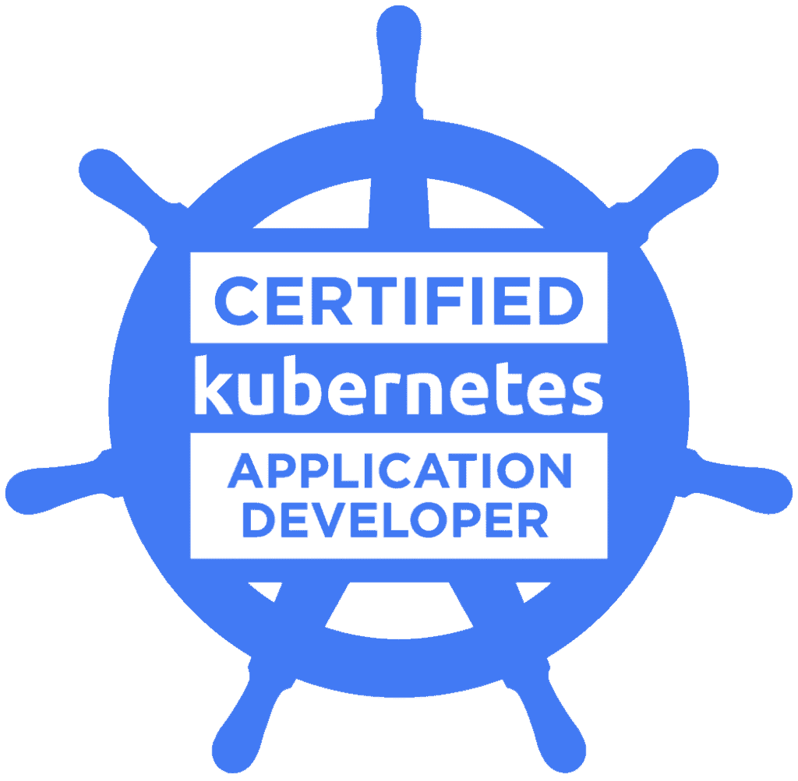

The [Certified Kubernetes Application Developer (CKAD)](https://www.cncf.io/certification/ckad/) program has been developed by the Cloud Native Computing Foundation (CNCF), in collaboration with The Linux Foundation, to help expand the Kubernetes ecosystem through standardized training and certification. Certification is a key step in that process, allowing certified application developers to quickly establish their credibility and value in the job market, and also allowing companies to more quickly hire high-quality teams to support their growth.

The online, proctored, performance-based test consists of a set of performance-based items (problems) to be solved in a command line and is expected to take approximately two (2) hours to complete.

This exam curriculum includes these general domains and their weights on the exam:

* 13% – Core Concepts
* 18% – Configuration
* 10% – Multi-Container Pods
* 18% – Observability
* 20% – Pod Design
* 13% – Services & Networking
* 8% – State Persistence

# Working with Kubernetes

Kubernetes (K8s) is an open-source system for automating deployment, scaling, and management of containerized applications. It groups containers that make up an application into logical units for easy management and discovery. 

## Set up Minikube

Minikube is an open source tool that enables you to run Kubernetes on your laptop or other local machine. It can work with Linux, Mac, and Windows operating systems. It runs a single-node cluster inside a virtual machine on your local machine.

The easiest way to install Minikube on macOS is using Homebrew:

	brew install minikube

Start Minikube and create a cluster:

	minikube start

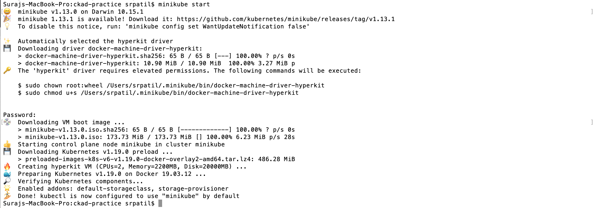

Once minikube start finishes, run the command below to check the status of the cluster:

	minikube status

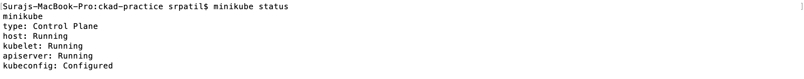

## Create our Pods

To start a Kubernetes cluster from a Pod definition file, type following command:

	kubectl create -f pod-definition.yml

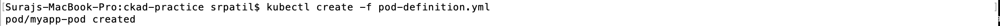

And to start a cluster using a Replication Controller, type following command:

	kubectl create -f rc-definition.yml

To check all the pods and their health type the following command:

	kubectl get pods

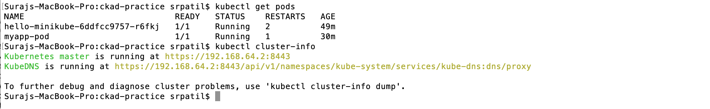

## Create our Deployment

To start a Kubernetes cluster from a Deployment definition file, type following command:

	kubectl create -f deployment-definition.yml

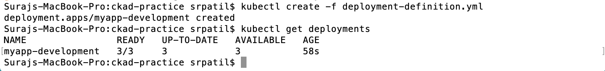

To check all the deployments and their health type the following command:

	kubectl get deployments

The Deployment automatically creates a Replicaset, which can be viewed by the following command:

	kubectl get replicaset

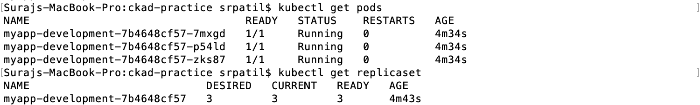

## Set up Kubernetes Dashboard

You can use Dashboard to get an overview of applications running on your cluster, as well as for creating or modifying individual Kubernetes resources (such as Deployments, Jobs, DaemonSets, etc)

The Dashboard UI is not deployed by default. To deploy it, run the following command:

	kubectl apply -f https://raw.githubusercontent.com/kubernetes/dashboard/v2.0.0/aio/deploy/recommended.yaml

You can access Dashboard using the kubectl command-line tool by running the following command:

	kubectl proxy 

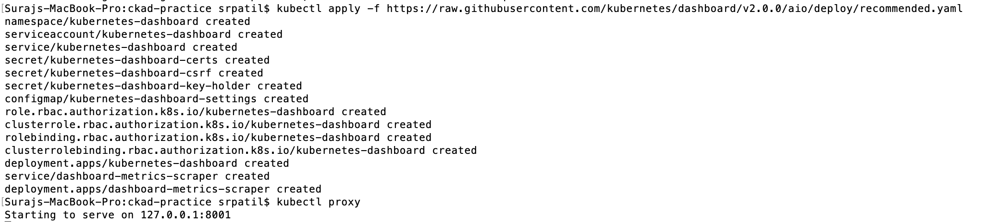

There are two options to authenticate our Kubernetes dashboard account; using either the token or the kubeconfig method. I used the token method given in this [blog](https://www.replex.io/blog/how-to-install-access-and-add-heapster-metrics-to-the-kubernetes-dashboard).

When you access Dashboard on an empty cluster, you'll see the welcome page. This page contains a link to this document as well as a button to deploy your first application. Dashboard lets you create and deploy a containerized application as a Deployment and optional Service with a simple wizard. 

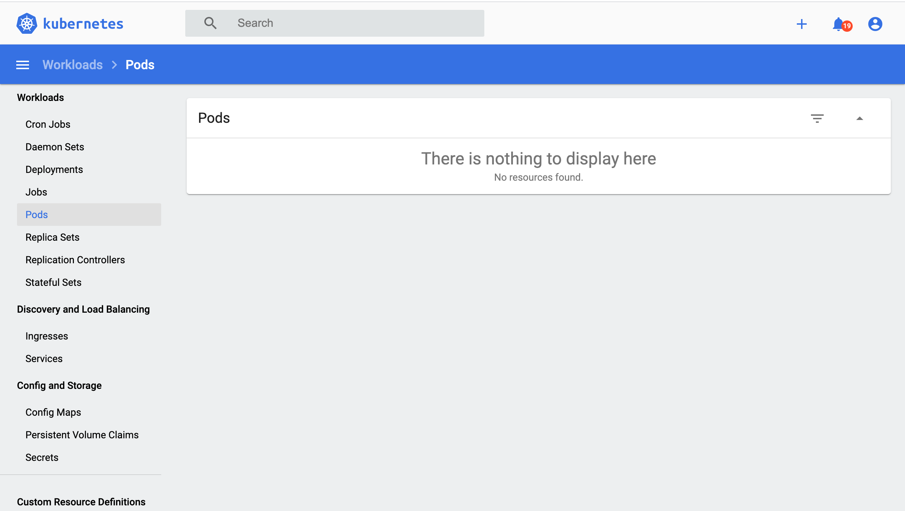

You need to bind the dashboard service account to the cluster admin role, otherwise, the dashboard services account doesn't have access to the data that would populate the dashboard.

Type the following command: 

	kubectl create clusterrolebinding dashboard-admin-sa --clusterrole=cluster-admin --serviceaccount=default:dashboard-admin-sa

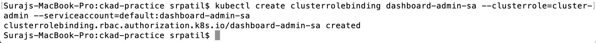

Now we can see that our Pods health is visible on the WebUI

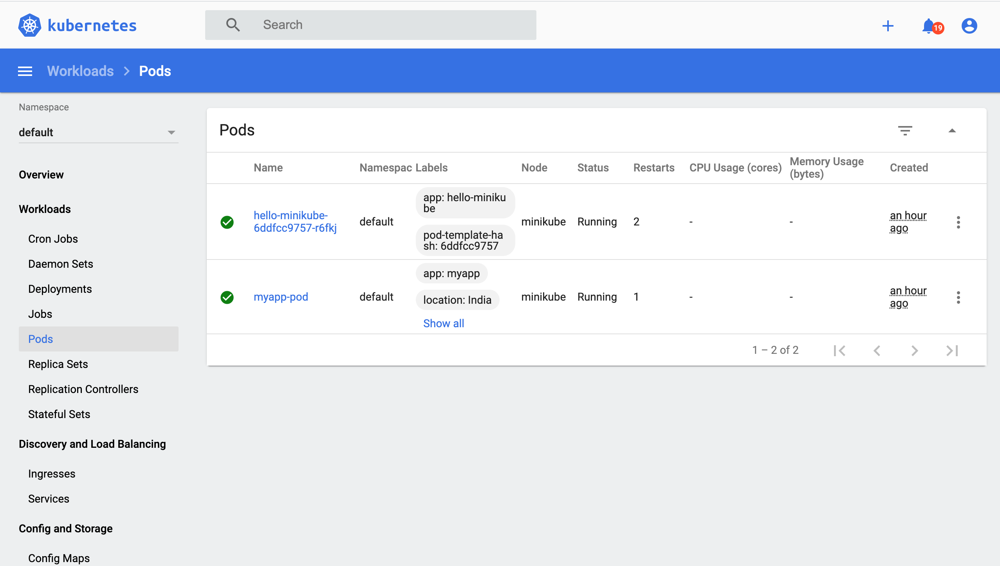

## Gracefully Shutting Down Pods and Cluster

There are tons of blog posts about tearing down onpremise clusters by cleaning up everything, and some answers about shutting down nodes in public clouds (so that if your provider doesn't charge for the master, you're as good as in a poweroff state), nothing about properly shutting down an on-premise cluster like ours. The general answer seems to be "it's fine." Just stop your cluster using minikube commands below and then manually terminate the running kubectl processes if any are left.

To delete individual Pods, run: 

	kubectl delete pods <pod1-name> <pod2-name>

To delete Replication Controller (also deletes the underlying Pods) , run:

	kubectl delete replicationcontrollers <rc1-name> <rc21-name>

To stop your cluster, run:

	minikube stop

then you need to clear minikube's local state:

	minikube delete

